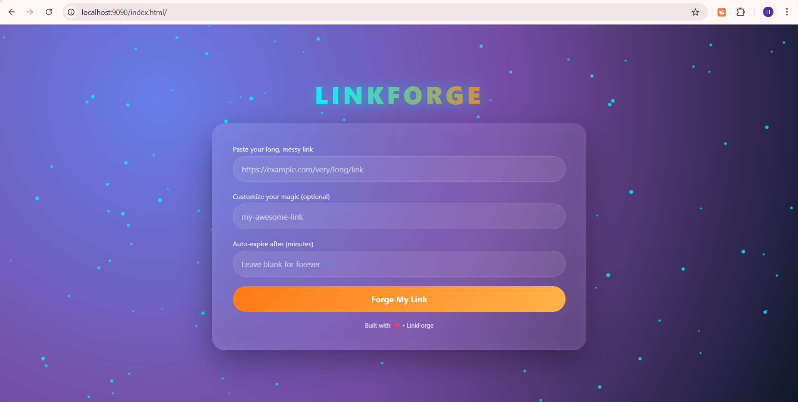
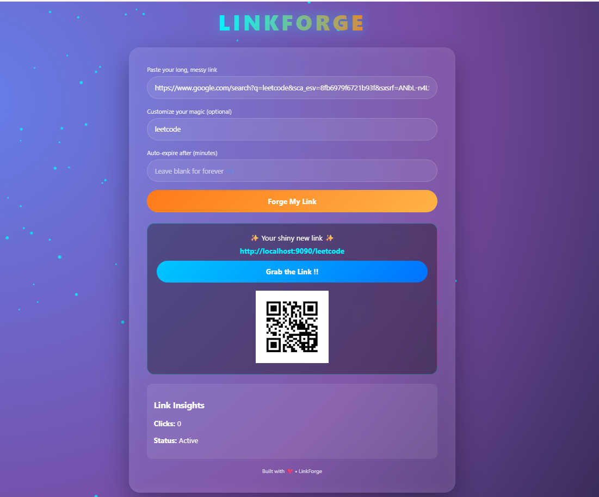
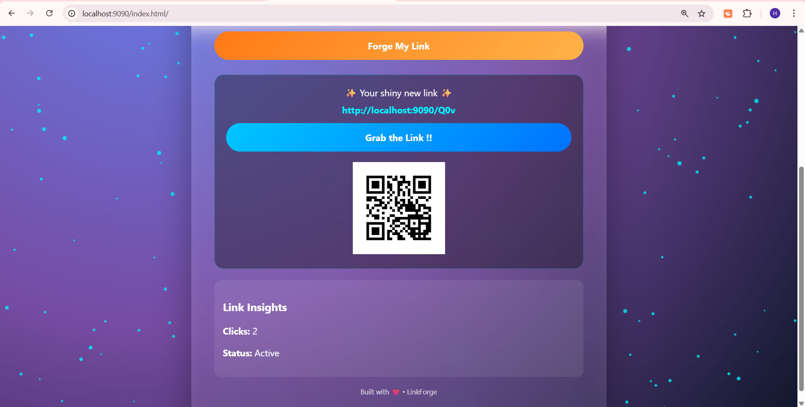

# LinkForge — A URL Shortening Platform

LinkForge is a production-ready URL shortening service built with Spring Boot that transforms long URLs into compact, shareable links with real-time analytics and QR generation.

## Features

- Shorten long URLs instantly  
- Custom alias support  
- Link expiry management  
- Real-time click analytics  
- Duplicate URL prevention   
- QR code generation  
- Modern UI  

## Tech Stack

**Backend**
- Java 17  
- Spring Boot  
- Spring Data JPA  
- MySQL  
- Maven  

**Frontend**
- HTML5  
- CSS3
- Vanilla JavaScript  

**Libraries**
- ZXing (QR Code generation)  
- Lombok  


## Tools Used

- VS Code  
- Git  
- GitHub  
- Postman  
- MySQL Workbench  
- Maven Wrapper

## Project Structure
src/main/java/com/example/demo
├── controller
├── service
├── repository
├── entity
├── dto
└── util


##  Setup Instructions

### 1️⃣ Clone the repository

```bash 
git clone https://github.com/Hasvitha-M/linkforge.git
cd linkforge
```

### 2️⃣ Configure MySQL

Update in application.properties:
```bash
spring.datasource.url=jdbc:mysql://localhost:3306/linkforge
spring.datasource.username=YOUR_USERNAME
spring.datasource.password=YOUR_PASSWORD
```

### 3️⃣ Run the application
 ```bash
mvn spring-boot:run
```
App will start at:
```bash
http://localhost:9090
```

## API Endpoints 
```bash
🔹 Shorten URL: POST /api/shorten
🔹 Redirect: GET /{shortCode}
🔹 Analytics: GET /api/analytics/{code}
🔹 QR Code: GET /api/qr/{code}
```


## Demo

Paste a long URL → Forge → Get short link + QR + analytics.


## Application Preview

### Home Interface


### Shortened Link Result


### Analytics & QR View



